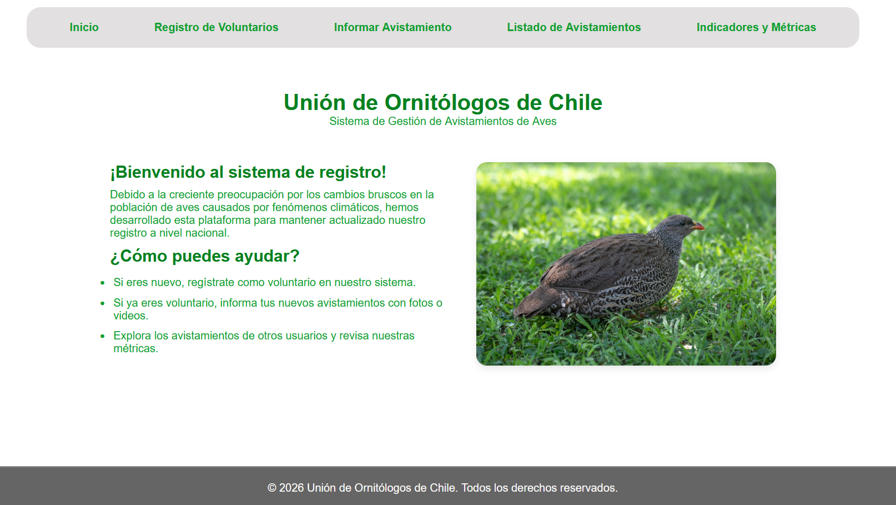
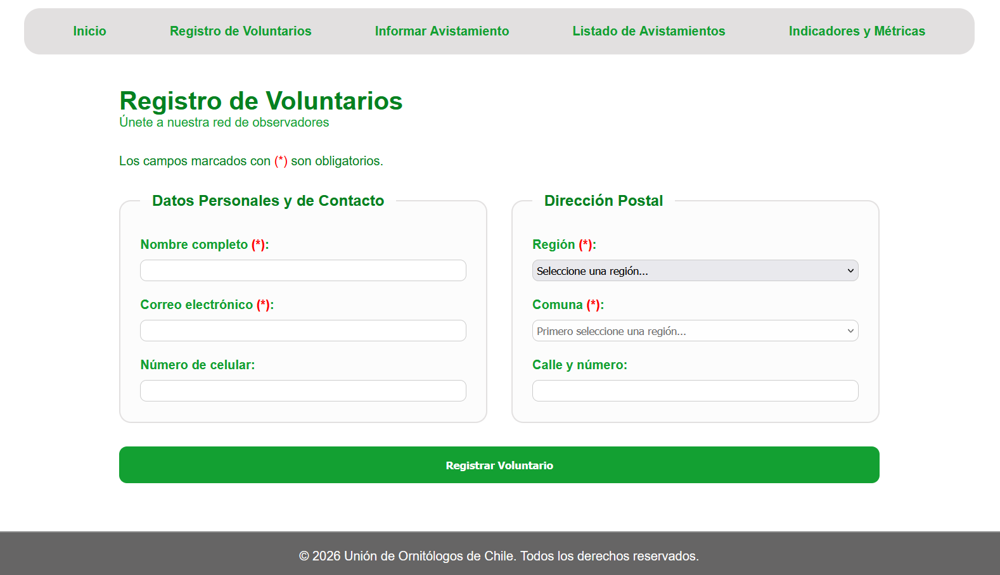
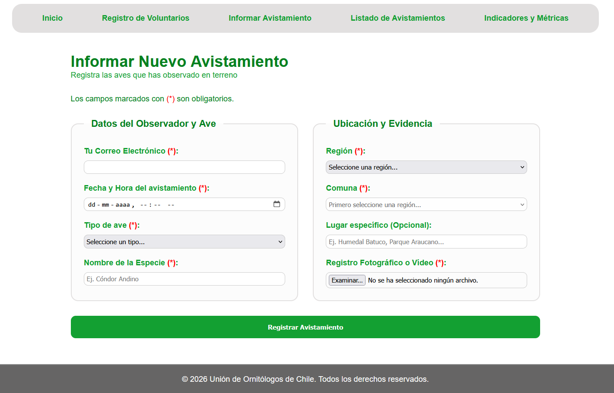
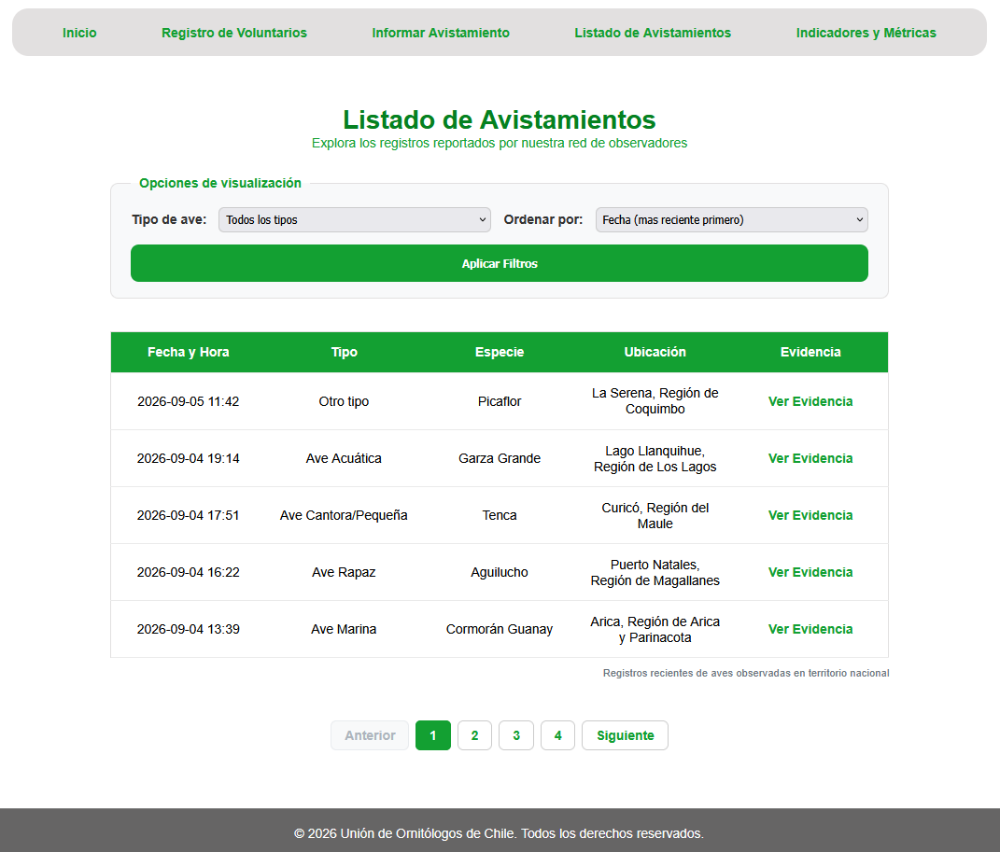
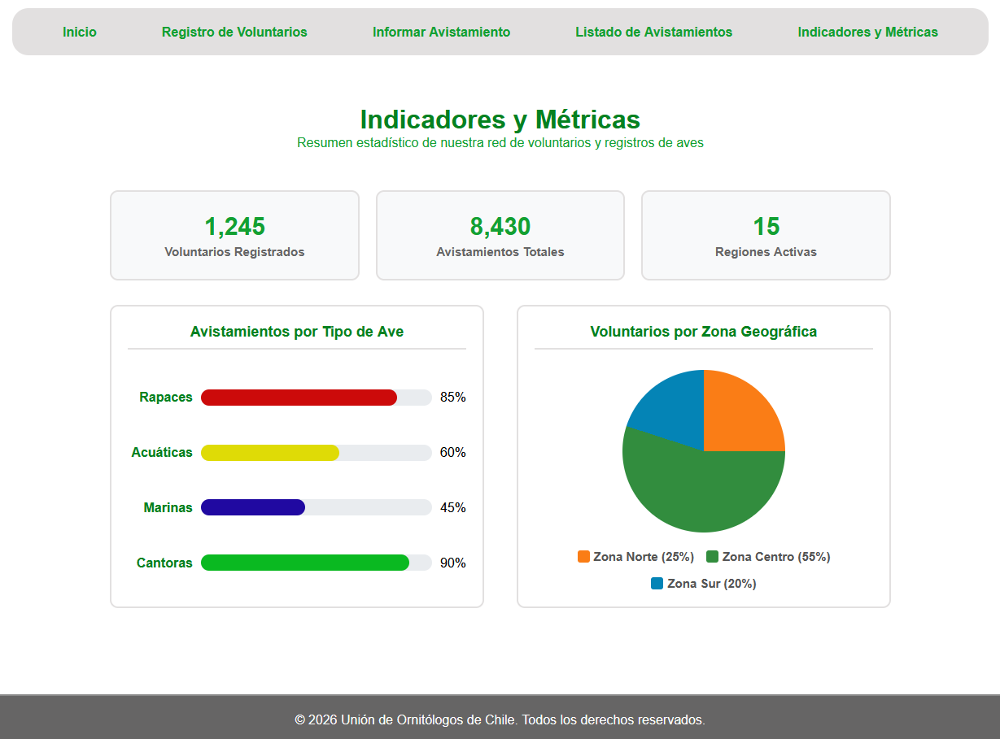

# Repositorio del Curso Desarrollo Web

## Detalles y Decisiones - Tarea 1

Este repositorio contiene el "prototipo Frontend" para el sistema web de la "Unión de Ornitólogos de Chile". La plataforma permite la gestión de voluntarios y el registro descentralizado de avistamientos de aves a lo largo del país, operando de manera responsiva y sin depender de un backend para su demostración funcional.

* **HTML5 Semántico:** Se priorizó el uso de etiquetas semánticas (`<nav>`, `<main>`, `<section>`, `<article>`, `<figure>`) minimizando el uso de `
` para mejorar la accesibilidad.
* **CSS3 Nativo y Responsivo:** Todo el diseño se construyó con CSS puro utilizando Flexbox, variables globales (`:root`) para mantener la coherencia visual, y Media Queries para adaptar el contenido a dispositivos móviles. No se utilizaron frameworks externos.
* **Lógica de Estado en Memoria (JS Puro):** Dado que es un prototipo sin base de datos, la manipulación de datos (filtrado, ordenamiento y paginación) se realiza en memoria utilizando Vanilla JavaScript.
* **Visualización de Datos:** Los gráficos de métricas fueron implementados 100% con CSS (`conic-gradient` y variables in-line), prescindiendo de librerías externas para optimizar la carga.

---

## Vistas de la Aplicación

### 1. Inicio y Navegación
Página de bienvenida con el menú global que conecta todas las secciones.

### 2. Registro de Voluntarios
Formulario con validación de datos para la inscripción de nuevos participantes.

### 3. Informar Avistamiento
Interfaz para la subida de datos en terreno, soportando validación de imágenes y videos.

### 4. Listado de Avistamientos
Tabla de datos que implementa filtros por tipo de ave, ordenamiento por fecha/lugar y un sistema de paginación generado dinámicamente. En móviles, la tabla transiciona a un diseño de tarjetas de lectura rápida.

### 5. Indicadores y Métricas
Panel de control con resumenes de la "Unión" y gráficos estadísticos renderizados nativamente con CSS.

---